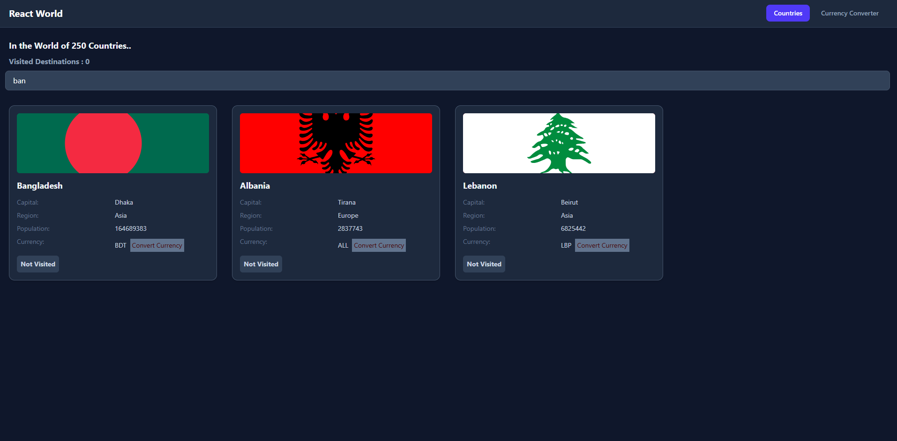

# React World — Countries Explorer & Currency Converter

## Overview

**React World** is a modern React-based web application that allows users to explore countries across the globe and perform real-time currency conversions. The project combines API-driven data, dynamic routing, and interactive UI components to deliver a practical application.

---

## Features

### Countries Explorer

* Browse a list of countries with key details
* View:

  * Official name
  * Capital
  * Region
  * Population
  * Currency Code
  * Flag
* Responsive grid layout using Tailwind CSS

### Currency Converter

* Convert between global currencies
* Auto-detect base currency from selected country
* Real-time conversion using external API
* Swap currencies instantly (Need Modification)

### Navigation

* Click a country → opens converter with pre-selected currency
* URL-based state using query parameters:

  ```
  /converter?from=usd
  ```

### State Management

* Controlled inputs for real-time updates
* Auto recalculation on:

  * Amount change
  * Currency change

---

## Tech Stack

* **Frontend:** React (Hooks)
* **Styling:** Tailwind CSS
* **Routing:** React Router
* **API:** Currency API (exchange rates)
* **State Management:** useState, useEffect
* **Custom Hooks:** useCurrencyInfo

---

## Project Structure

```
React-World/
│
├── components/
│   ├── Country.jsx
│   ├── Countries.jsx
│   ├── CurrencyConverter.jsx
│   ├── Input.jsx
│
├── hooks/
│   ├── useCurrencyInfo.js
│
├── App.jsx
├── main.jsx
└── README.md
```

---

## Installation & Setup

### Clone the repository

```bash
git clone https://github.com/your-username/react-world.git
cd react-world
```

### Install dependencies

```bash
npm install
```

### Run the development server

```bash
npm run dev
```

---

## Usage

1. Browse countries on the homepage
2. Click a country card
3. Automatically navigate to converter
4. Currency is pre-selected based on country
5. Enter amount → get instant conversion

---

## Key Concepts Demonstrated

* React component composition
* Lifting state up
* Custom hooks for API abstraction
* Controlled components
* Dynamic routing with query parameters
* Conditional rendering
* API integration & async data handling

---

## Known Limitations

* Exchange rates may not be real-time (API dependent)
* Some countries may have missing currency data
* No caching implemented (can be optimized)

---

## Future Improvements
* Cache API responses for performance
* Dark/light theme toggle
---

## Screenshots 



---

## Live Demo

👉 Try the app here:  
https://gleeful-gumption-df8e12.netlify.app/

## License

This project is open-source and available under the MIT License.

---

## Author

**Miraj**
Aspiring Full-Stack Developer (MERN)


